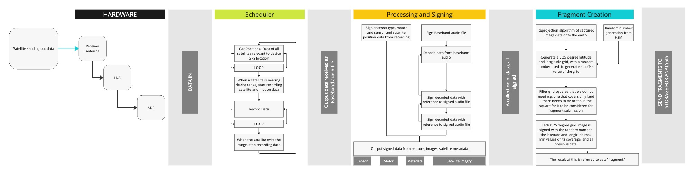

#  A foreword on data 
Our satellite receiver POC device will be able to listen to and receive data agnostically from all satellites. 
We will now discuss the format of that data and how we shape it from satellite, to POC device, to averaged SST value underpinning the worlds economy.  

