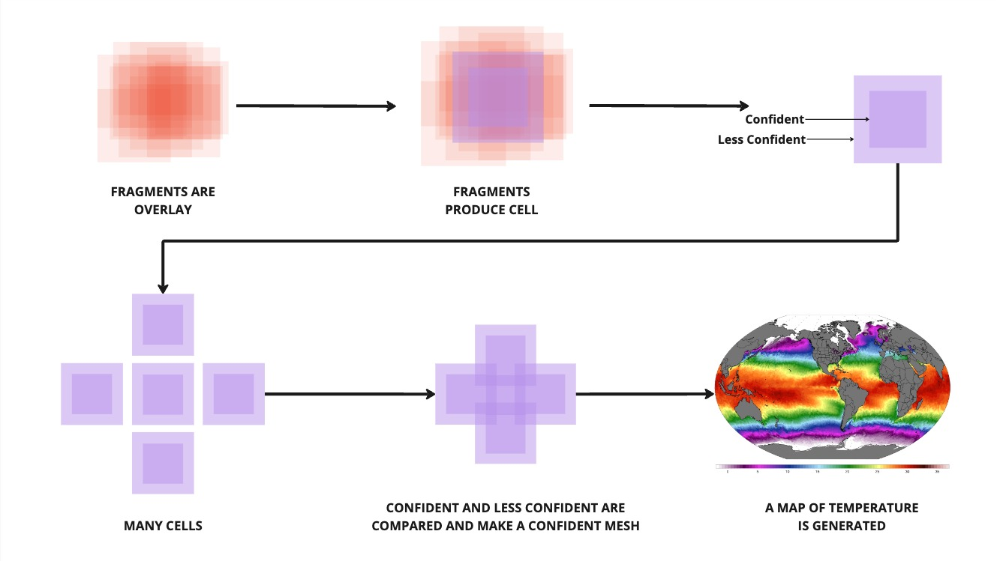

# Cell and Map Creation
## Working theory

Bringing this all together with the above image. 
- We made a bunch of fragments earlier with our cool POC receiver. 
- We stored all of them in a storage medium. 
- We make some cells
- We stitch those cells together
- We make a map
- We have completed our dataset for SST for 1x day. 

## Cell creation 
The first step here is cell creation. 
We will develop the app for this, and it will exist independently of running a satellite receiver, so it gives people who aren't ready to purchase a hardware device, or who live underground already and don't have the luxury of direct line of sight to a satellite the chance to also contribute to verifying the data, and farm tokens in preparation for the end of the world (more on that coming up!). 
Our cell builder app with grab a bunch of fragments in a latitude and longitude range, and will verify them against each other. As there will be a large overlay in the center of the cell, we will be very confident about the value of this. In the outer edges of the cell we are slightly less confident.

## Map building
When building the entire map, we begin to stitch all of the cells together. This is almost a repeat of the fragments to cells program, but allows for extra scrutiny to ensure we have an accurate representation of temperature values for each cell. 
I guess we can sort of look at this as rounds of consensuses.