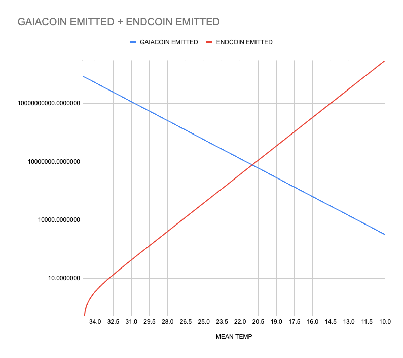
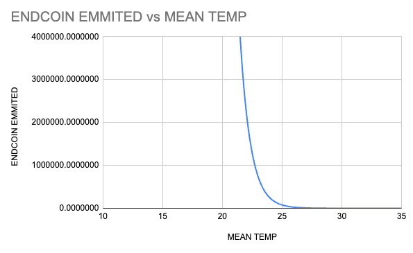
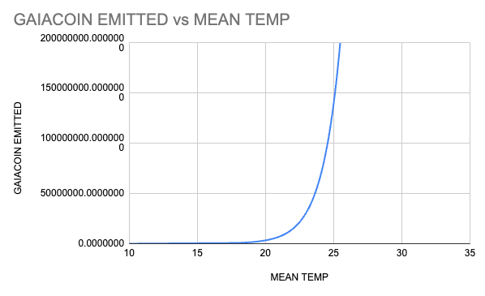

# Emission formula
Our current working formula is: 
- death (d) = 35 (when its too hot to handle)
- endrate (e) = 1.125
- gaiarate (g) = 0.75
- meanTemperature (T) = current average sst temp on a daily basis

#### Endcoin
\\[ E = exp(e* (d - T)) -1 \\]

#### Gaiacoin
\\[ G = exp(g * T) - 1 \\]

This graphs as two exponential functions, with Endcoin hitting exactly 0 when global average Sea Surface Temperature hits 35 degrees (Spoiler alert, we'll all be dead). When this happens, you see Gaiacoin spin wildly out of control, emitting around 293 billion into the economy each day temperatures are at 35 degrees... It'll still be the least of our worries though so DON'T PANIC. 

How they compare: 

Endcoin vs Mean Temp: 

Gaiacoin vs Mean Temp: 

## Some reasoning
Q: Why are the endrate and gaiarate different? 

`A: The world can be damaged faster than it can be fixed, this adds that to the underpinning of the system`

Q: Why is the crossover point neatly pegged at 21 degrees C? 

`A: In 2023/2024 the average sea surface temp for the whole year is around 21 degrees, so we use this as the crossover point, as this is when our new financial system starts.`

# Data point as a constant 
We have now successfully emitted tokens based on a real world data point which has climate impact. This begins to bridge the gap between financial markets and climate science for people not directly interested in ReFi opportunities. 

If I'm just an oil barron degen, I can still invest in Endcoin and short the end of the world for unlimited gains, but this is now proveable, on chain, for the whole world to see. 

